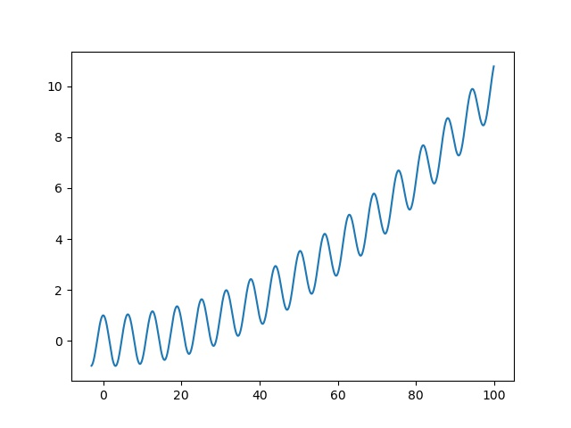
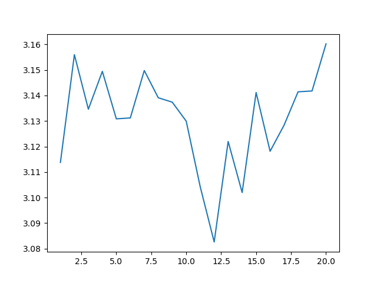
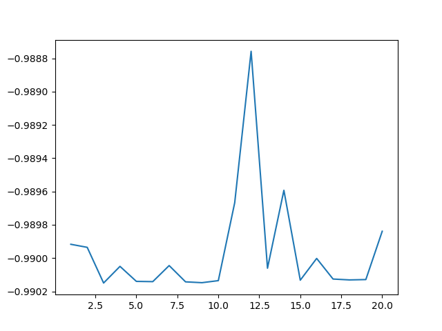
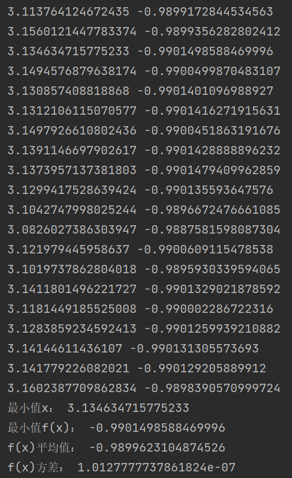
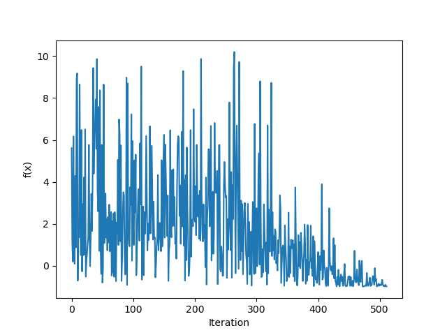

# 考核作业一实验报告
## 选择多极小函数
选择一个简单的多极小函数：$y = \frac{1}{1000}x^2 + cos(x)$

此函数有许多极小值，同时它是偶函数，因此有两个最小值，我们选用它图像右侧部分，选取区间 [3, 100] 进行计算，真实图像如下：

## 算法选择
选择基础的SA算法，其中下一个解的寻找方法选用在当前解周围随机选取高斯分布的解，自己搭建了SA算法的接口，详情见代码，这里贴出一些核心函数。

```py
# 按照高斯分布随机选择下一个点
def next_solution(self):
    sigma = max(self.end - self.x, self.x - self.start) / 3
    while True:
        new_x = random.gauss(self.x, sigma)
        if self.is_valid(new_x):
            break
    return new_x
```

```py
# metropolis准则
def metropolis(self, x, new_x):
    e = self.f(x)
    new_e = self.f(new_x)
    if new_e <= e:
        return True
    else:
        p = np.exp((e - new_e) / self.T)
        return True if random.random() < p else False
```

```py
# 搜索函数
    def search(self):
        # 温度循环
        while self.T > self.Tf:
            # 找出目前为止的最优解
            self.x = self.min_x()
            # print(self.x)
            # 内层循环
            for i in range(self.iter):
                new_x = self.next_solution()
                if self.metropolis(self.x, new_x):
                    self.x = new_x
            self.all_x.append(self.x)
            self.T *= self.alpha
        # self.iter_pic()
        return self.min_x(), self.f(self.min_x()), self.all_x
```
## 算法效果
### 二十次随机试验统计结果：
X：  
  
Y:  
  
统计数据：  
  
最差效果为第十二次仿真，-0.9888  

典型仿真曲线，其中f(x)为每个温度下经过小循环得到的解  

### 算法特点：
本试验用的测试函数有很多极小值，因此需要算法有很强的”跳出陷阱“能力，即在局部最优解能概率性地跳出并最终趋于全局最优，这就是SA算法所追求的。其出发点是基于物理中固体物质的退火过程与一般组合优化问题之间的相似性，通过赋予搜索过程一种时变且最终趋于零的概率突跳性，从而可有效避免陷入局部极小并最终趋于全局最优的串行结构的优化算法。从实验结果来看，算法非常有效的解决了我们的问题，每次拟合得到的数据都非常接近最小值，拟合的方差很小。
### 实验体会
首先，，模拟退火算法项本门课程所学的许多其他算法一样，有一个有趣的名字和有趣的原理。它借鉴真实的物理现象，正如遗传算法等，都是由大自然得到灵感。我认为这样的创新思路非常有魅力。拿退火算法来说它的核心思路是按衰减的概率让函数随机跳出局部，这样的作法并不稀奇，但是加上退火，热能那一套公式，感觉就有趣了起来，其中衰减概率的metropolis准则我想换成别的也可以，这样的思路有无限的挖掘空间。