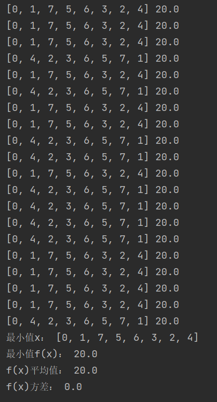
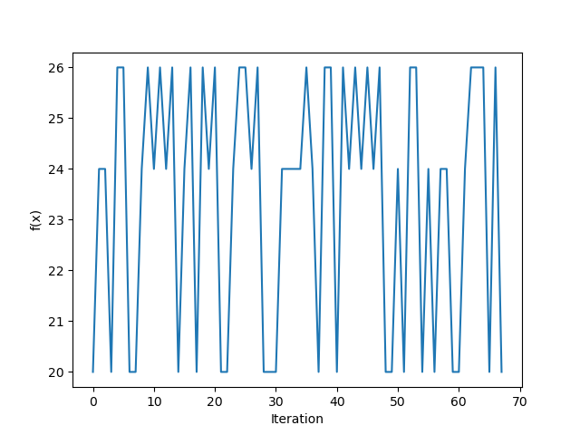

# 考核作业二实验报告
## 定义TSP问题
TSP问题有许多定义方法，这里我选择让求从0号城市出发访问每一座城市并回到0号城市的最短回路，地图如下：  

## 算法选择
仍旧选择考核问题一的SA算法，将接口调整了一下。首先要将TSP问题表达成求函数最小值的问题，将路程表示为一串由数字0~7组成的编码，0节点代表初始城市，1-7节点表示其他7座城市。例如 1，7，6，3，2，5，4 表示从0出发依次经过城市1、7、6、3、2、5、4最后回到0。在地图上实际能走通的编码即为函数定义域。定义能量即为路程的总cost，用8*8的矩阵表达各个城市之间的路程关系。修改后的一些核心代码如下，详情见py文件：
```py
# 编辑路程map
graph = nx.Graph()
graph.add_nodes_from(range(0, 8))
edges = [(0, 1, 3), (0, 4, 2),
            (1, 4, 3), (1, 5, 4), (1, 7, 2),
            (2, 3, 5), (2, 4, 1), (2, 5, 4), (2, 6, 3),
            (3, 6, 1),
            (4, 5, 5),
            (5, 6, 2), (5, 7, 4),
            (6, 7, 4)]
graph.add_weighted_edges_from(edges)
mat = nx.to_numpy_array(graph)
```

```py
# 随机选择下一个点
# 考虑到两个解不能差的太远，选择类似洗牌的随机方法，随机选择一半数的顺序不变，另一半打乱顺序随机插进去
# 但这样做会导致时间慢，后来之间改成纯shuffle了
def next_solution(self, x):
    # print(x, end = ' ')
    x = x[1:]
    l_shuffle = int(len(x) / 2)
    while True:
        # shuffle_choice = np.random.choice(list(range(len(x))), replace=False, size=l_shuffle)
        # shuffle_order = np.random.choice(list(range(len(x))), replace=False, size=l_shuffle)
        # new_x = [-1] * len(x)
        # for i in range(l_shuffle):
        #     new_x[shuffle_order[i]] = x[shuffle_choice[i]]
        # unshuffle = []
        # for i in range(len(x)):
        #     if i not in shuffle_choice:
        #         unshuffle.append(i)
        # mark = 0
        # for i, n in enumerate(new_x):
        #     if n == -1:
        #         new_x[i] = x[unshuffle[mark]]
        #         mark += 1
        random.shuffle(x)
        new_x = [0] + x

        if self.is_valid(new_x):
            break
    # print(new_x, self.is_valid(new_x))
    return new_x
```

```py
# 解是否有效
def is_valid(self, x):
    for i in range(len(x) - 1):
        if self.mat[x[i]][x[i+1]] == 0:
            return False
    if mat[x[-1]][x[0]] == 0:
        return False
    return True
```

```py
# 解的总cost
def cost(self, x):
    cost = 0
    for i in range(len(x) - 1):
        if self.mat[x[i]][x[i+1]] != 0:
            cost += self.mat[x[i]][x[i+1]]
        else:
            return False
    return cost + mat[x[-1]][x[0]]
```
## 算法效果
### 二十次随机试验统计结果：
统计数据：  
  
可以看出每次仿真得到的都是最优解（回路可逆因此有两种最优解），算法非常可靠，最优解为：[0, 1, 7, 5, 6, 3, 2, 4, 0] 或 [0, 4, 2, 3, 6, 5, 7, 1, 0]

典型仿真曲线，其中f(x)为每个温度下经过小循环得到的解  
  

### 算法特点：
SA算法的出发点是基于物理中固体物质的退火过程与一般组合优化问题之间的相似性，通过赋予搜索过程一种时变且最终趋于零的概率突跳性，从而可有效避免陷入局部极小并最终趋于全局最优的串行结构的优化算法。从实验结果来看，算法非常有效的解决了我们的问题，每次得到的都是最优解，这是因为此问题定义域较小，算法在随机跳跃过程中能够遍历完全。
### 实验体会
首先，，模拟退火算法项本门课程所学的许多其他算法一样，有一个有趣的名字和有趣的原理。它借鉴真实的物理现象，正如遗传算法等，都是由大自然得到灵感。我认为这样的创新思路非常有魅力。拿退火算法来说它的核心思路是按衰减的概率让函数随机跳出局部，这样的作法并不稀奇，但是加上退火，热能那一套公式，感觉就有趣了起来，其中衰减概率的metropolis准则我想换成别的也可以，这样的思路有无限的挖掘空间。
而本实验相比实验一更加有趣，因为是在解决一个实际问题，将不那么显示的问题数学化表达，再用算法解决，非常的有意思。